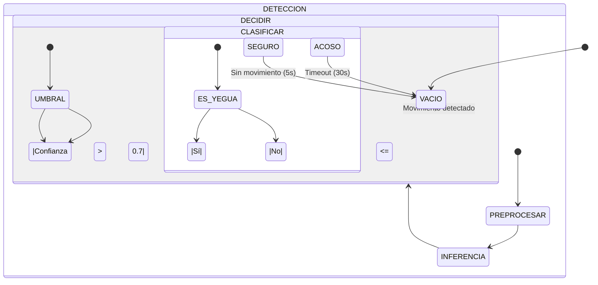

# 🐎 EL BANQUETE DE LAS YEGUAS: Instalación Artística Interactiva con IA

> **✨ Una exploración sobre el acoso callejero a través de la Visión por Computadora y el Deep Learning**

<div align="center">
  
  <p><em>🖥️ Interfaz de la instalación interactiva - Detección en tiempo real</em></p>
</div>

## 📋 Tabla de Contenidos
- [🎯 Resumen Ejecutivo](#-resumen-ejecutivo)
- [⚙️ Stack Tecnológico](#️-stack-tecnológico)
- [📊 Data Pipeline](#-data-pipeline)
- [🧠 Modelado y Arquitectura](#-modelado-y-arquitectura)
- [📈 Evaluación del Modelo](#-evaluación-del-modelo)
- [🚀 Guía de Instalación](#-guía-de-instalación)
- [📂 Estructura del Proyecto](#-estructura-del-proyecto)
- [🤝 Contribuciones](#-contribuciones)
- [📄 Licencia](#-licencia)
- [👩‍🎨 Autora](#-autora)

## 🎯 Resumen Ejecutivo

**YEGUA** es una instalación de arte digital reactiva que utiliza **Inteligencia Artificial** en tiempo real para generar conciencia sobre el acoso. El sistema monitorea el entorno mediante una cámara y clasifica la presencia de espectadores para detonar una respuesta audiovisual inmersiva:

### 🎭 Estados de la Instalación

| Estado | 🟣 Acoso (Yegua detectada) | 🟢 Seguro (Persona) | ⚫ Vacío (Sin movimiento) |
|--------|---------------------------|-------------------|--------------------------|
| **Sonido** | 🔊 Ambiente intenso | 🎵 Música ambiental | 🔇 Silencio |
| **Luces** | 💥 Intermitentes | 💡 Suaves | 🌑 Apagadas |
| **Visual** | 📝 Frases de acoso | ✨ Mensajes positivos | 🌌 Pantalla en reposo |

Este proyecto demuestra un **ciclo completo de Ciencia de Datos (End-to-End)**, desde la ingeniería de datos hasta el despliegue en producción sin conexión (Edge AI) en dispositivos de bajo rendimiento.

---

## ⚙️ Stack Tecnológico

### 🛠️ Herramientas Principales
- **Lenguaje**: Python 3.10+
- **Deep Learning**: TensorFlow 2.15, Keras (MobileNetV2)
- **Computer Vision**: OpenCV 4.8+
- **Interfaz/Audio**: Pygame 2.5+
- **Despliegue**: PyInstaller (.exe)

### 📚 Dependencias
```bash
# requirements.txt
tensorflow==2.15.0
opencv-python>=4.8.0
numpy>=1.21.0
pygame>=2.5.0
```

---

## 📊 Data Pipeline

### 🔍 1. Adquisición de Datos
- **Script**: `scripts/descargar_dataset.py`
- **Fuentes**: Búsqueda automatizada con `duckduckgo_search`
- **Filtros**: 
  - Tamaño mínimo: 640x480px
  - Formatos: JPG, PNG, WebP
  - Licencia: Dominio público/CC0

### 🧹 2. Limpieza y Estandarización
- **Script**: `scripts/estandarizar_imagenes.py`
- **Procesamiento**:
  - Conversión a RGB
  - Redimensión a 224x224px
  - Normalización de histograma
  - Eliminación de duplicados

### 🔄 3. Aumento de Datos
- Rotación: ±30°
- Zoom: 20%
- Desplazamiento: 10%
- Volteo horizontal
- Variación de brillo/contraste

---

## 🧠 Modelado y Arquitectura

### 🏗️ Arquitectura del Modelo
```python
# Extracción de características con MobileNetV2
base_model = MobileNetV2(
    weights="imagenet",
    include_top=False,
    input_shape=(224, 224, 3)
)

# Capas personalizadas
model = Sequential([
    base_model,
    GlobalAveragePooling2D(),
    Dense(128, activation="relu"),
    Dropout(0.5),
    Dense(1, activation="sigmoid")
])
```

### 🎯 Estrategias de Entrenamiento
- **Transfer Learning** con pesos pre-entrenados en ImageNet
- **Regularización**: Dropout del 50%
- **Optimizador**: Adam con learning rate 1e-4
- **Función de pérdida**: Binary Crossentropy

## 📈 Evaluación del Modelo

### 📊 Métricas Principales
| Métrica | Valor | 📊 |
|---------|-------|----|
| **Accuracy** | 97.55% | ▰▰▰▰▰▰▰▰▰▰ |
| **Precision** | 0.98 | ▰▰▰▰▰▰▰▰▰▰ |
| **Recall** | 0.97 | ▰▰▰▰▰▰▰▰▰▱ |
| **F1-Score** | 0.975 | ▰▰▰▰▰▰▰▰▰▱ |
| **Latencia** | ~97 ms | ⚡ Rápido |
| **FPS** | ~10 FPS | 🎥 Fluido |

### 📉 Matriz de Confusión


## Lógica de Inferencia en Tiempo Real

El sistema implementa un pipeline de procesamiento optimizado en `main.py`:

### Flujo de Procesamiento
1. **Detección de Movimiento**
   - Análisis de diferencia de cuadros (frame differencing)
   - Umbral adaptativo para diferentes condiciones de iluminación
   - Filtrado de ruido con operaciones morfológicas

2. **Pre-procesamiento**
   - Redimensionamiento a 224x224 píxeles
   - Normalización de píxeles (0-1)
   - Aumento de contraste (CLAHE)

3. **Clasificación**
   - Inferencia con el modelo MobileNetV2 optimizado
   - Suavizado temporal con media móvil (3 frames)
   - Umbral de confianza ajustable

### Máquina de Estados



### Optimizaciones
- **Inferencia por Lotes:** Procesamiento por lotes cuando es posible
- **Gestión de Memoria:** Liberación explícita de recursos
- **Threading:** Procesamiento en segundo plano para mantener la fluidez
- **Logging:** Registro detallado para depuración

## 🚀 Guía de Instalación

### 📋 Requisitos del Sistema
- **Sistema Operativo**: Windows 10/11, macOS 10.15+, o Linux
- **Python**: 3.10 o superior
- **Cámara Web**: Resolución mínima 720p recomendada
- **RAM**: Mínimo 4GB (8GB recomendado)

### 🛠️ Instalación
1. Clonar el repositorio:
   ```bash
   git clone https://github.com/veraguillen/Instalacion-Yegua-IA.git
   cd Instalacion-Yegua-IA
   ```

2. Crear y activar entorno virtual:
   ```bash
   python -m venv venv
   source venv/bin/activate  # Linux/Mac
   .\venv\Scripts\activate  # Windows
   ```

3. Instalar dependencias:
   ```bash
   pip install -r requirements.txt
   ```

4. Ejecutar la aplicación:
   ```bash
   python main.py
   ```

### ⚙️ Configuración Avanzada
Edita `config.json` para personalizar:
- Umbrales de detección
- Rutas de recursos
- Parámetros de rendimiento
- Configuración de audio/visual

## 📂 Estructura del Proyecto
```
.
├── 📁 analysis/           # Scripts de evaluación
├── 📁 data/               # Datos y modelos
│   ├── 📁 raw/            # Datos sin procesar
│   ├── 📁 processed/      # Datos procesados
│   └── 📁 train/          # Dataset de entrenamiento
├── 📁 scripts/            # Scripts de utilidad
├── 📄 main.py             # Punto de entrada principal
├── 📄 README.md           # Este archivo
└── 📄 requirements.txt    # Dependencias
```

### 📦 Contenido de Carpetas
- **/analysis**: Scripts de evaluación y métricas
- **/data**: 
  - /raw: Imágenes descargadas
  - /processed: Imágenes procesadas
  - /train: Dataset final
- **/scripts**: Herramientas para procesamiento

## 👩‍🎨 Autora

**Vera Guillén**  
[](https://www.linkedin.com/in/vera-guillen-9b464a303/)  
[](https://vera-guillen.vercel.app/)  
[](https://github.com/veraguillenm)

### 🎨 Declaración Artística
*"Este proyecto busca generar reflexión sobre el acoso callejero a través de la interacción con tecnologías emergentes."

## 🤝 Contribuciones
¡Las contribuciones son bienvenidas! Por favor, lee nuestras [pautas de contribución](CONTRIBUTING.md) antes de enviar un pull request.

## 📄 Licencia
Este proyecto está bajo la Licencia [CC BY-NC-SA 4.0](LICENSE).

---

<div align="center">
  <sub>Creado con ❤️ por Vera Guillén | 2025</sub>
</div>