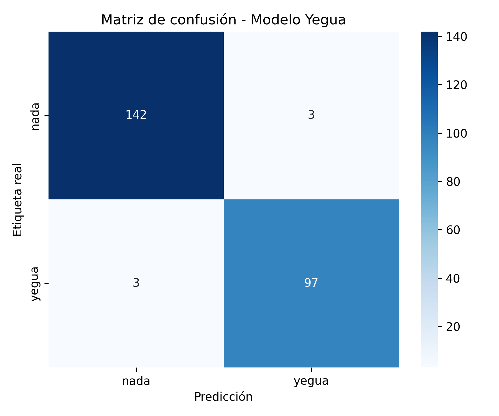
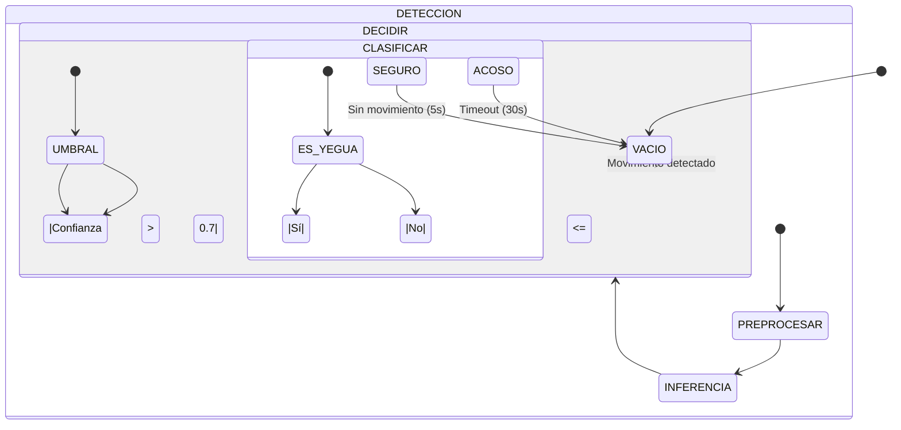

# EL BANQUETE DE LAS YEGUAS: Instalación Artística Interactiva con IA

> **Una exploración sobre el acoso callejero a través de la Visión por Computadora y el Deep Learning**

<div align="center">
  
  <p><em>Interfaz de la instalación interactiva - Detección en tiempo real</em></p>
</div>

## Resumen Ejecutivo

**YEGUA** es una instalación de arte digital reactiva que utiliza **Inteligencia Artificial** en tiempo real para generar conciencia sobre el acoso. El sistema monitorea el entorno mediante una cámara y clasifica la presencia de espectadores para detonar una respuesta audiovisual inmersiva:

### Estados de la Instalación
- **Estado Acoso (Yegua detectada)**
  - Ambiente sonoro intenso y luces intermitentes
  - Visualización de texto con frases de acoso reales
  - Efectos visuales de distorsión

- **Estado Seguro (Persona sin máscara)**
  - Música ambiental relajante
  - Iluminación suave y estable
  - Mensajes de empoderamiento

- **Estado Vacío (Sin movimiento)**
  - Pantalla en reposo
  - Bucle de espera de bajo consumo
  - Mensaje de bienvenida intermitente

Este proyecto demuestra un **ciclo completo de Ciencia de Datos (End-to-End)**, desde la ingeniería de datos hasta el despliegue en producción sin conexión (Edge AI) en dispositivos de bajo rendimiento.

---

## Tech Stack & Herramientas

### Stack Tecnológico

| Área | Tecnologías |
|------|-------------|
| **Lenguaje** | Python 3.10+ |
| **Deep Learning** | TensorFlow 2.15, Keras (MobileNetV2) |
| **Computer Vision** | OpenCV 4.8+ |
| **Data Engineering** | DuckDuckGo Search, Requests, Pillow (PIL) |
| **Interfaz/Audio** | Pygame 2.5+ |
| **Optimización** | TensorFlow Lite (para versión móvil) |
| **Deployment** | PyInstaller (Standalone .exe) |
| **Control de Versiones** | Git, GitHub |
| **Documentación** | Markdown, MkDocs

---

## Data Pipeline (Ingeniería de Datos)

### Adquisición de Datos
Dado que no existía un dataset público para esta máscara específica, se desarrolló un pipeline ETL completo:

#### 1. Extracción de Datos (Web Scraping)
- **Script:** `scripts/descargar_dataset.py`
- **Fuentes:** Búsqueda automatizada con `duckduckgo_search`
- **Filtros:** 
  - Tamaño mínimo: 640x480px
  - Formatos: JPG, PNG, WebP
  - Licencia: Dominio público/CC0
- **Manejo de Errores:**
  - Timeouts configurados
  - Reintentos automáticos
  - Control de User-Agent

#### 2. Limpieza y Estandarización
- **Script:** `scripts/estandarizar_imagenes.py`
- **Procesamiento:**
  - Conversión a RGB (3 canales)
  - Redimensión a 224x224px
  - Normalización de histograma
  - Eliminación de duplicados (hash perceptual)
- **Organización:**
  - Estructura de carpetas por clase
  - Metadatos en JSON

#### 3. Aumento de Datos
- **Técnicas Aplicadas:**
  - Rotación: ±30°
  - Zoom: 20%
  - Desplazamiento: 10% (horizontal/vertical)
  - Volteo horizontal
  - Variación de brillo/contraste
- **Ratio:** 5x aumento del dataset original

---

## Modelado y Arquitectura

Se utilizó **Transfer Learning** sobre la arquitectura **MobileNetV2** (pre-entrenada en ImageNet). Esta red fue seleccionada por su arquitectura ligera (Depthwise Separable Convolutions), ideal para inferencia en tiempo real en CPUs estándar.

## Arquitectura del Modelo

```python
# Extracción de características con MobileNetV2
base_model = MobileNetV2(
    weights="imagenet",
    include_top=False,
    input_shape=(224, 224, 3)
)
base_model.trainable = False  # Congelar pesos pre-entrenados

# Capas personalizadas
model = Sequential([
    base_model,
    GlobalAveragePooling2D(),
    Dense(128, activation="relu"),
    Dropout(0.5),  # Regularización para evitar overfitting
    Dense(1, activation="sigmoid")  # Clasificación Binaria
])

# Configuración de entrenamiento
model.compile(
    optimizer=Adam(learning_rate=1e-4),
    loss="binary_crossentropy",
    metrics=["accuracy", tf.keras.metrics.AUC()]
)
```

### Estrategias de Entrenamiento
- **Transfer Learning:** Aprovechamiento de pesos pre-entrenados en ImageNet
- **Regularización:** Dropout del 50% para prevenir sobreajuste
- **Callbacks:**
  - EarlyStopping: Paciencia de 5 épocas
  - ModelCheckpoint: Guardado del mejor modelo
  - ReduceLROnPlateau: Reducción dinámica del learning rate

## Evaluación y Métricas

El modelo fue evaluado rigurosamente en un conjunto de validación independiente (20% de los datos):

### Métricas Principales
| Métrica               | Valor    | Interpretación                          |
|-----------------------|----------|-----------------------------------------|
| **Accuracy**          | 97.55%   | Precisión global del modelo             |
| **Precision**         | 0.98     | Bajo número de falsos positivos         |
| **Recall**            | 0.97     | Buen balance entre clases               |
| **F1-Score**          | 0.975    | Media armónica de precisión y recall    |
| **Latencia (CPU)**    | ~97 ms   | Rendimiento en tiempo real aceptable     |
| **Tasa de FPS**       | ~10 FPS  | Fluidez adecuada para la instalación     |

### Matriz de Confusión


*La matriz muestra un equilibrio óptimo entre las dos clases, con un mínimo de falsos positivos/negativos que podrían afectar la experiencia del usuario.*

## Lógica de Inferencia en Tiempo Real

El sistema implementa un pipeline de procesamiento optimizado en `main.py`:

### Flujo de Procesamiento
1. **Detección de Movimiento**
   - Análisis de diferencia de cuadros (frame differencing)
   - Umbral adaptativo para diferentes condiciones de iluminación
   - Filtrado de ruido con operaciones morfológicas

2. **Pre-procesamiento**
   - Redimensionamiento a 224x224 píxeles
   - Normalización de píxeles (0-1)
   - Aumento de contraste (CLAHE)

3. **Clasificación**
   - Inferencia con el modelo MobileNetV2 optimizado
   - Suavizado temporal con media móvil (3 frames)
   - Umbral de confianza ajustable

### Máquina de Estados



### Optimizaciones
- **Inferencia por Lotes:** Procesamiento por lotes cuando es posible
- **Gestión de Memoria:** Liberación explícita de recursos
- **Threading:** Procesamiento en segundo plano para mantener la fluidez
- **Logging:** Registro detallado para depuración

## Guía de Instalación

### Requisitos del Sistema
- **Sistema Operativo:** Windows 10/11, macOS 10.15+, o Linux
- **Python:** 3.10 o superior
- **Cámara Web:** Resolución mínima 720p recomendada
- **Espacio en Disco:** 1GB libre (incluyendo el modelo y dependencias)
- **RAM:** Mínimo 4GB (8GB recomendado)

### Instalación desde Código Fuente

1. **Clonar el repositorio**
   ```bash
   git clone https://github.com/veraguillen/Instalacion-Yegua-IA.git
   cd el-banquete-de-las-yeguas
   ```

2. **Configurar entorno virtual (recomendado)**
   ```bash
   python -m venv venv
   .\venv\Scripts\activate  # Windows
   source venv/bin/activate  # Linux/Mac
   ```

3. **Instalar dependencias**
   ```bash
   pip install -r requirements.txt
   ```

4. **Ejecutar la aplicación**
   ```bash
   python main.py
   ```
   *El sistema abrirá una ventana de configuración inicial para seleccionar la cámara y ajustar parámetros.*

### Versión Ejecutable (Standalone)

Para instalaciones en entornos de exhibición sin Python:

1. **Descargar el paquete**
   - Disponible en [Releases](https://github.com/veraguillenm/el-banquete-de-las-yeguas/releases)
   - Versiones para Windows (.exe), macOS (.app) y Linux (.AppImage)

2. **Instalación**
   - **Windows:** Ejecutar `Yegua_Instalacion_Setup.exe`
   - **macOS:** Arrastrar a la carpeta Aplicaciones
   - **Linux:** Dar permisos de ejecución y ejecutar

3. **Primera Ejecución**
   - La aplicación incluye todos los recursos necesarios
   - Se recomienda una calibración inicial de cámara

### Configuración Avanzada

El archivo `config.json` permite personalizar:
- Umbrales de detección
- Rutas de recursos
- Parámetros de rendimiento
- Configuración de audio/visual

## Estructura del Proyecto

```
el-banquete-de-las-yeguas/
│
├── assets/                    # Recursos multimedia
│   ├── audio/                 # Pistas de audio
│   │   ├── ambiente/          # Sonidos de fondo
│   │   └── efectos/           # Efectos de sonido
│   └── fonts/                 # Fuentes tipográficas
│
├── data/                      # Datos y modelos
│   ├── processed/             # Datos procesados
│   │   ├── train/             # Conjunto de entrenamiento
│   │   │   ├── yegua/        # Imágenes positivas
│   │   │   └── nada/         # Imágenes negativas
│   │   └── val/              # Conjunto de validación
│   ├── raw/                  # Datos sin procesar
│   └── models/               # Modelos guardados
│       └── modelo_yegua.keras
│
├── analysis/                 # Análisis y métricas
│   ├── confusion_matrix.png
│   ├── training_history.png
│   └── classification_report.txt
│
├── scripts/                  # Herramientas
│   ├── data/                
│   │   ├── descargar_dataset.py
│   │   └── estandarizar_imagenes.py
│   ├── train/
│   │   └── train_model.py
│   └── utils/
│       ├── config.py
│       └── logger.py
│
├── main.py                  # Punto de entrada principal
├── requirements.txt         # Dependencias
├── setup.py                # Script de instalación
└── README.md               # Este archivo
```

### Descripción de Carpetas

- **/assets**: Contiene todos los recursos multimedia necesarios para la instalación.
- **/data**: Organización clara de datos crudos, procesados y modelos.
- **/analysis**: Reportes y visualizaciones para evaluación del modelo.
- **/scripts**: Herramientas modulares para el procesamiento de datos y entrenamiento.

## Sobre la Artista y Desarrolladora

### Vera Guillén
**Artista Digital & Desarrolladora de Software**

[](https://www.linkedin.com/in/vera-guillen-9b464a303/)
[](https://vera-guillen.vercel.app/)
[](https://github.com/veraguillenm)

### Declaración Artística
*"Este proyecto busca generar reflexión sobre el acoso callejero a través de la interacción con tecnologías emergentes. Al convertir al espectador en partícipe activo, la instalación invita a experimentar físicamente las dinámicas de poder que se generan en el espacio público, cuestionando los límites entre lo público y lo privado, lo íntimo y lo colectivo."*

---

## Licencia

Este proyecto está bajo la Licencia [Creative Commons Attribution-NonCommercial-ShareAlike 4.0 International](https://creativecommons.org/licenses/by-nc-sa/4.0/).

[![CC BY-NC-SA 4.0][cc-by-nc-sa-shield]][cc-by-nc-sa]

[cc-by-nc-sa]: http://creativecommons.org/licenses/by-nc-sa/4.0/
[cc-by-nc-sa-shield]: https://img.shields.io/badge/License-CC%20BY--NC--SA%204.0-lightgrey.svg

---

## Contribuciones

Las contribuciones son bienvenidas. Por favor, lee las [guías de contribución](CONTRIBUTING.md) antes de enviar un pull request.

## Contacto

Para consultas sobre exposiciones, colaboraciones o preguntas técnicas:
- ✉️ contacto@veraguillen.art
- 🌐 [veraguillen.art](https://veraguillen.art)

---

<div align="center">
  <sub>Creado con ❤️ por Vera Guillén | 2023</sub>
</div>